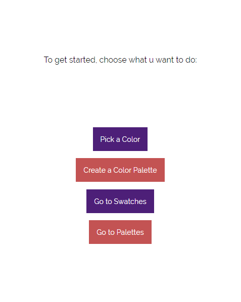
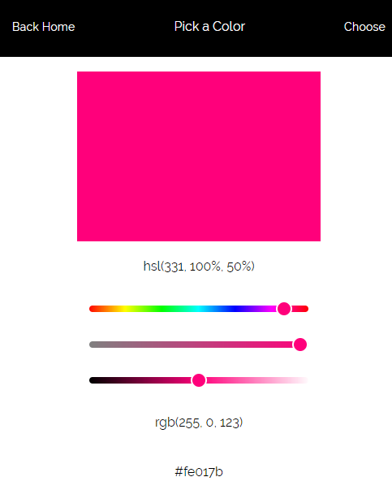
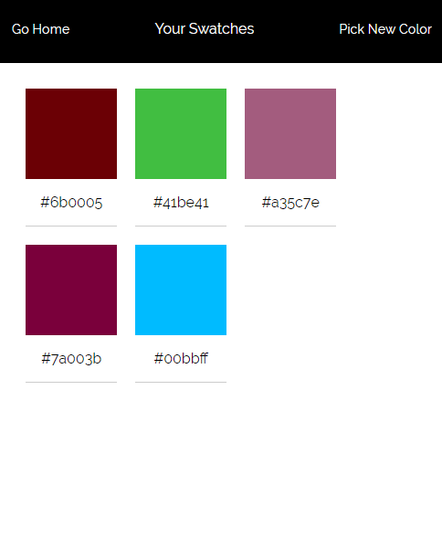
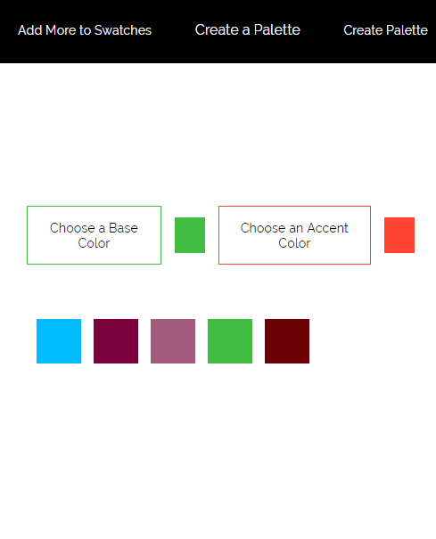
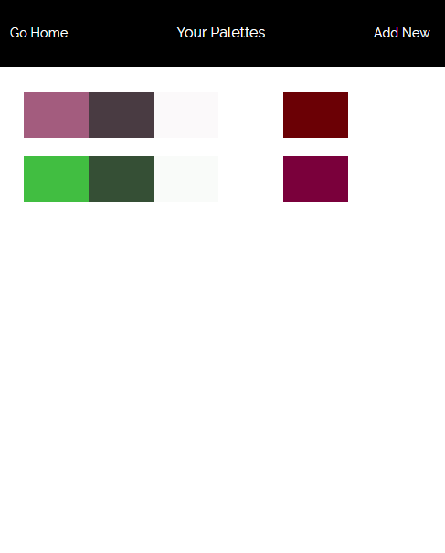

# [Swatch](http://fazeelanizam.com/swatch)

This is an app that was bootstrapped with [Create React App](https://github.com/facebook/create-react-app) which lets you pick colors, save and access them later. You can also select two colors out of your saved ones as base and accent colors and the app will create a basic five-color palette for your project, which you also can save and access later (using local storage.)

  
  
  
  
  

The principle behind how this app creates a color palette is how it's described in the article [A Simple Web Developer’s Color Guide](https://www.smashingmagazine.com/2016/04/web-developer-guide-color/) by [Laura Elizabeth.](https://github.com/laura-elizabeth)  
I have used a dynamic SVG, HTML canvas and two simple CSS properties to programmatically find the rest of the colors that harmonizes with the chosen base and accent colors.

I've been using this method to create color palettes for almost all of my projects upto now, and I hopefully wouldn't have to open up Photoshop to do that anymore ;)

## Acknowledgements

* Thanks to [this codepen](https://codepen.io/yazeedalhimali/pen/jOPLwJr) of pure JS which I borrowed and tweaked, I didn't have to code the color picker from scratch.

## Built with

* ReactJS
